# Bike-Sharing Analysis
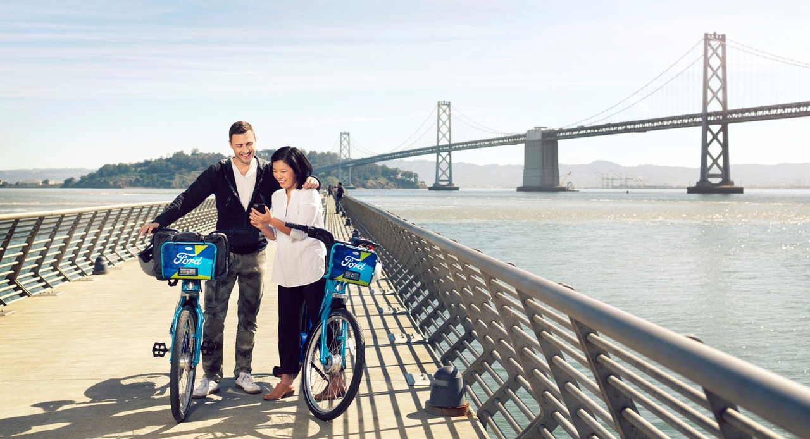
*Photo courtesy of Ford GoBike*

## San Francisco Bay Area
The scope of this analysis is to explore bike-sharing environment with a data mindset.

[Ford GoBike](https://www.fordgobike.com/) shares anonymized data about their users' trips. If you are curious, the open source data can be downloaded here: [System Data](https://www.fordgobike.com/system-data).

I strongly believe that not everything can be solved using data, but I also believe that many processes could be improved, and many opportunities could be caught, and many threats could be avoided just by gathering and analyzing data.

Mobility is a fundamental asset for a big city and several companies are investing an incredible amount of money to develop innovative sharing services. With this project, I would like to propose business actions that aim to improve the sharing system, also, by exploring new trends in the field.

## The Data Science Process
I read many articles and theories about how a data science process should be structured, such as [“Data Science Deconstructed”](https://ajgoldstein.com/2017/11/12/deconstructing-data-science/) by [AJ Goldstein](https://www.linkedin.com/in/ajgoldstein/) or [“O.S.E.M.N.”](https://www.kdnuggets.com/2018/05/beginners-guide-data-science-pipeline.html) by [Randy Lao](https://www.linkedin.com/in/randylaosat/).

After having considered them, I decided to adapt those cycles to my project and it is shown in the info-graphic below:
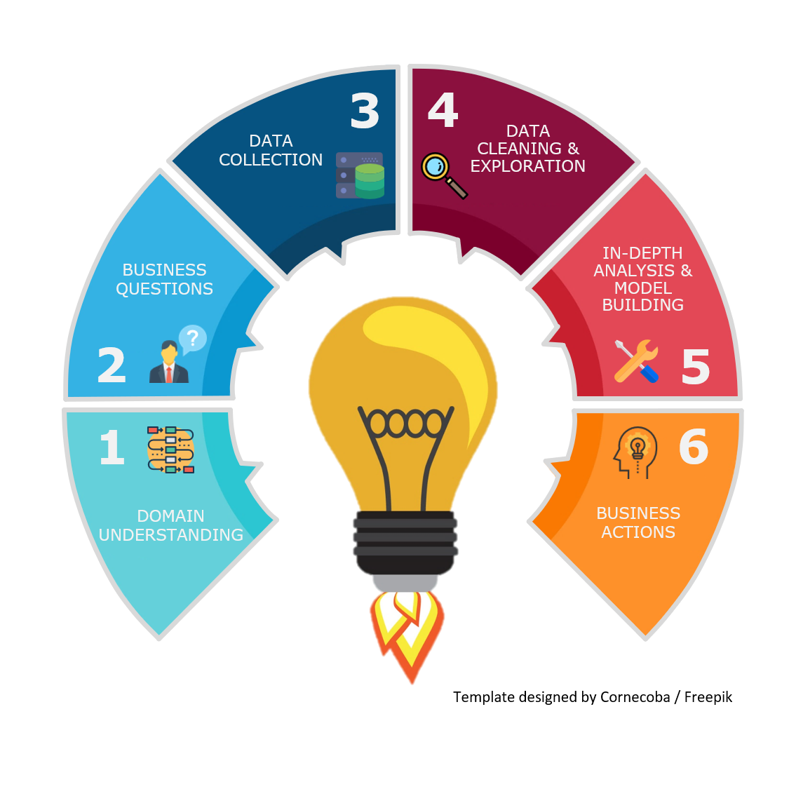

## 1 Domain Understanding
As the first stage of the process, I think it is crucial to understand the context and the business that we analyze.

Customers can go to a dock (bike station), take the bike after having unlocked it through the App, and then they can leave the bicycle in one of the stations that are based around the city. This service was launched in August 2013 with the name “Bay Area Bike Share” and in June 2017 it became Ford GoBike because of the partnership with Ford Motor Company. It currently has around 2500 bikes and 290 stations across San Francisco, San Jose and Bay’s East Coast.

The system is operated by [Motivate](https://www.motivateco.com/), a New York-based company that provides the bike-share system and operates in a partnership with the Metropolitan Transportation Commission and the Bay Area Air Quality Management District.

Expectations are that the entire system will reach 7000 bikes and 540 stations in the Bay Area.

## 2 Business Questions
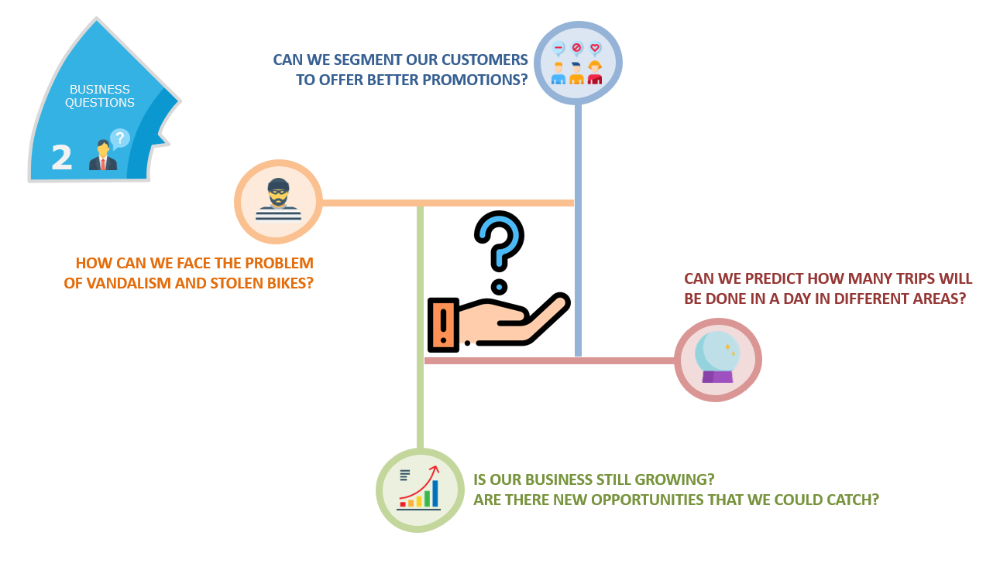

The goal of the study was not to perfectly solve all the questions, however, I formulated them to be the main drivers of the analysis.

## 3 The Dataset
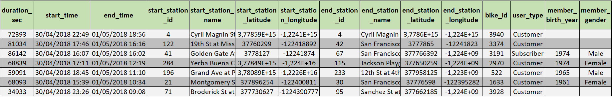

This is what the data looks like. Each row represents a user's trip.

In this analysis I only considered San Francisco's data, but the same study could be easily translated for San José and East Bay locations.

User type is one of the main variables that I used because of the different patterns among customers and subscribers.

*Subscriber: Frequent user with a subscription plan.*

*Customer: Occasional user who buys single rides.*

## 4 Data Cleaning and Exploration
Data cleaning and preparation often take a huge amount of time in an analytics project. In my case, I was quite lucky because the information was pretty clear.

As preparation task, I only fixed the date format for all the files available. To complete that task I used a very simple [R script](https://gist.github.com/FedericoRaimondi/4e07c34d8813fc76f3db2c12518774cf).

In order to explore the Ford GoBike's data, I used Tableau, that is one of the leaders in the analytics and business intelligence market as reported by Gartner in its magic quadrant.

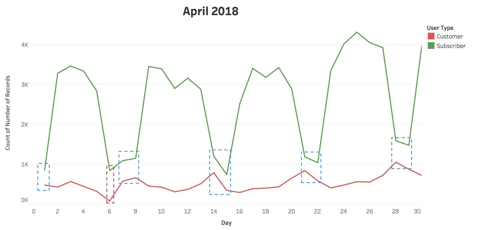

The graph above shows the number of subscribers and customers for the days in April 2018. I circled in blue the weekends and I displayed an outlier in red.

We can clearly see the difference in terms of behavior between the two types of users.

Subscribers have a more regular pattern and they mostly use the service during the weekdays rather than the weekends. That is probably due to the fact that they ride to reach or leave their workplace.

On the other side, customers have a more distributed usage and they often reach the peak on Saturdays.

The next visualization is similar to the one I displayed before, however, here there is the average trip duration in seconds by type of users in a specific hour. I performed the average for the overall duration trip between the same hour in April 2018.

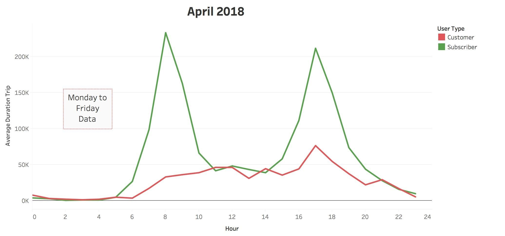

The first graph takes into account only Monday to Friday data. We can observe that subscribers have two peaks around 8 a.m. and 5 p.m.. This is confirming that they do use the bikes to reach the workplace. Customers have a more flat curve and we do not notice a significant increase during the day.

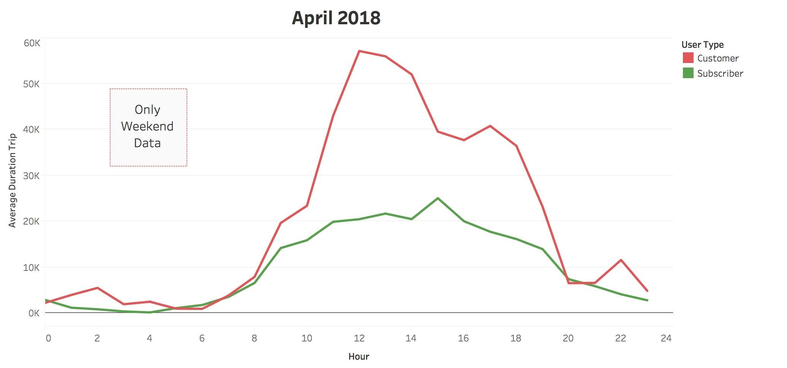

The second graph shows only weekend data. Completely different situation, isn't it?

Even if there are less customers than subscribers, they use for a longer period of time the service. Even if we perform the median duration trip in seconds we obtain the same conclusion (*Customer: 1,005.5; Subscriber: 536*).

Finally, the last exploration task that I performed is dividing trip duration by the number of users in that specific hour. By doing so, we obtain a duration weighted by the demand and we can also perform the average between the same hours within the month.

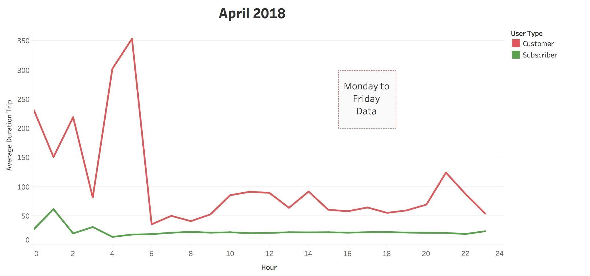
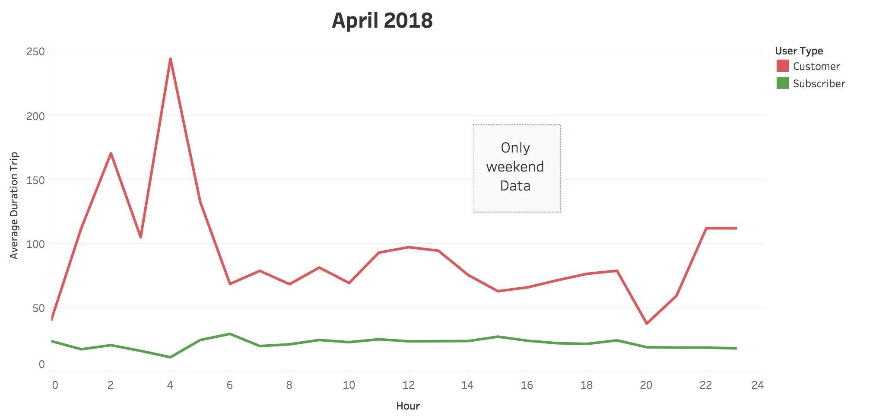

This indicator is an average trip duration in seconds per user. Observing the last two graphs, we can clearly distinguish subscriber nature, that is constant during the day, from customer’s one, that is more sloped.

In conclusion, data exploration is a crucial part of this kind of study. By visualizing and investigating our information, we obtain a great picture of our business, and we can also make faster and more rationalized decisions.

## 5 In-depth Analysis and Model Building
*Do we really need a predictive analysis?*

Yes, we do need predictive analytics in every business and there are many reasons for that.

The first one is that if you are able to know in advance what is going to happen with the right confidence intervals, then you can think, develop, and deploy business solutions more carefully. The opposite scenario is reacting when something already happened, so, the risk is much higher and, of course, our decisions will be made in a rush.

How many times have we heard the sentence *“If I had known earlier, …”*? Well, this is exactly why we need to think about the future.

The second point, that maybe is less obvious than the previous one, is that the effort that we make when we face a predictive problem it’s like a gym for our mind because we train our brain to think in the mid-long term and not only at the present. Changing our mindset is fundamental to switch from a classic company to a data-driven one. In my opinion, this will be the main challenge that all businesses have to face in the near future.

Analytics is becoming more accessible for everyone and from the first point of view it is thrilling, but it also means that our competitors will have this weapon to use. It is worth it to spend the time thinking about new solutions or new opportunities related to the world of data.

To select between several time-series models I wrote a [Gretl script](https://gist.github.com/FedericoRaimondi/840ce42c00cb97823be2c2bf745f0acf) and ARMA(1,0) resulted to be the best among the others.

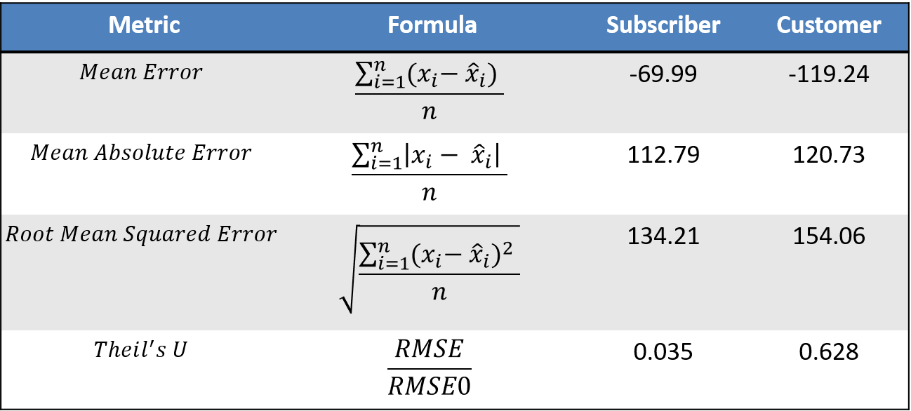

Where 𝑥̂𝑖: predicted value; 𝑛: number of observations; 𝑅𝑀𝑆𝐸0: it is the 𝑅𝑀𝑆𝐸 of a naïve model.

In the table we can see how the models performed. Subscribers' model is better than the customers' one. The reason is that the regular pattern of frequent users is easier to predict rather than the occasional one.

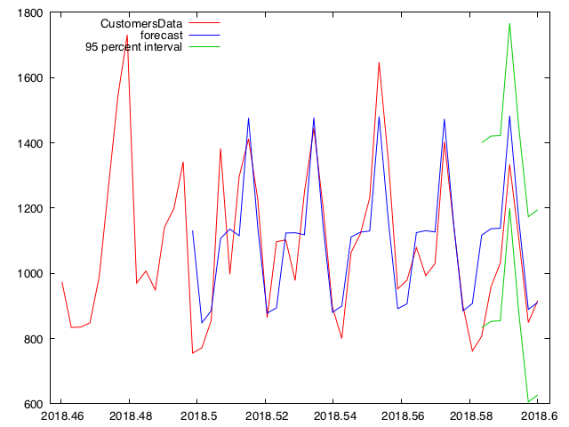
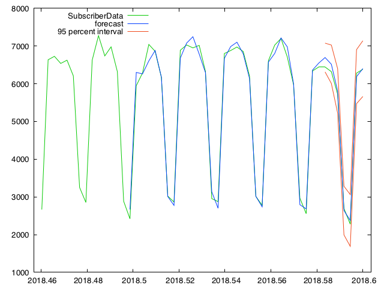

Even from the prediction graphs we can clearly notice the difference between the two models. In fact, confidence intervals look much wider in the upper graph (Customers).

In conclusion, the entire predicting process didn’t take too much time and for sure it will be worth the effort. Automation is a crucial step in this kind of analysis and there are many solutions to deliver a reusable model such as the software I mentioned before.

## 6 Business Actions

In this section, I would like to propose some business solutions. Of course, I am not considering any related costs because those are not open source data. Integrating this analysis with those kind of information can derive very interesting insights.

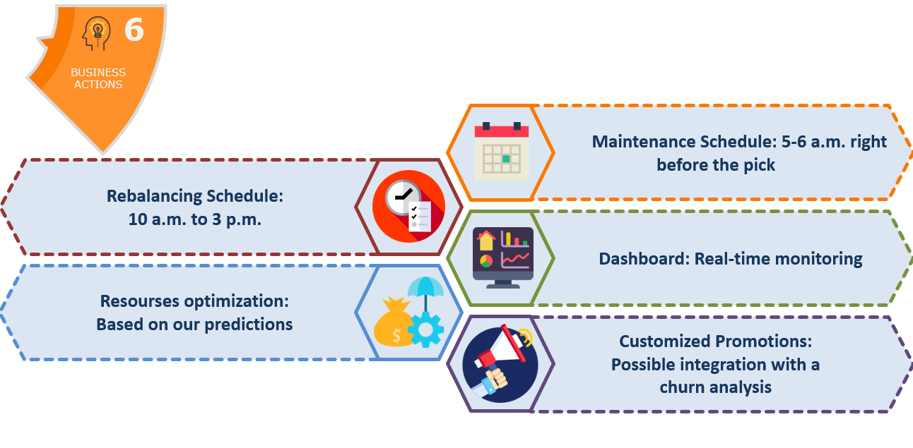

Then, I prepared a little demo to show the dashboard's features. The platform is realized with Tableau too.

### Bike Sharing Dashboard

## New Trends & Opportunities

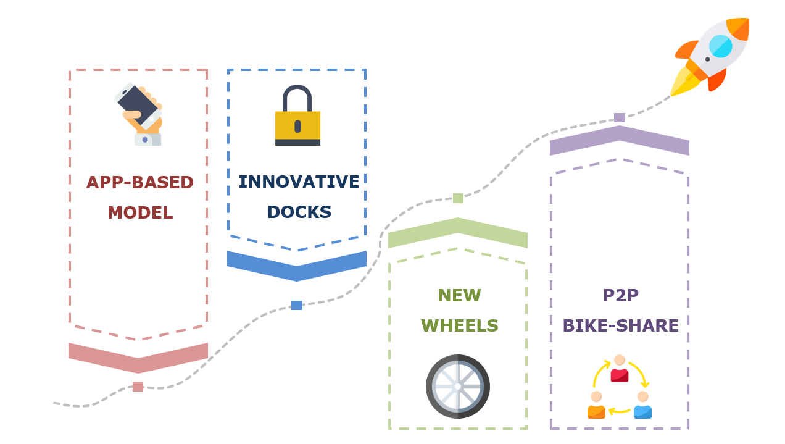

### App-based model

Mobile applications have several advantages and many different uses.

For instance, Ofo and Mobike have a dockless sharing system where apps play a core role. Users can find a free bike on the map shown in the screen. Simply scanning a QR code they can start riding around the city. Once they lock up the bike, the transaction will be automatically charged on their card. However, this type of service comes with many challenges because cities are not happy to see piles of abandoned bikes.

Then, these companies can’t set high prices. They need to have a low-cost model because the riding experience isn’t the best you can find. Maintenance costs and vandalism become a key aspect in evaluating the business profitability, even more than classic bike-shares.

Apps are also used in many dock-systems and again we can see free bikes location (or docks if we need to leave the bike) on the map. Payments are automated in this case too and not only they will let the user save a lot of time but they will also improve the whole service.

### Innovative Docks

We have already seen dockless systems used by some companies. In the next future, the evolution of those solutions will become the challenge to have a competitive advantage.

There is already a company, called [Social Bicycles](http://socialbicycles.com/), that is pioneering models based on GPS technology inside the bikes. With SoBi’s system, users may leave their bikes wherever they prefer within a geo-fenced area using locks similar to the Ofo’s ones. Investing in this kind of technology is a huge opportunity and, in the long term, it will reduce stations fixed-costs, without considering that it simplifies significantly the user’s life.

Dockless solutions are interesting also from a data point of view. They will help the owner of the service gathering precise moving information, because users have less restrictions to leave the bike.

GPS technology in each bike has also another scope: defeat vandalism. This is a well-known issue in the bike-share field. Limiting this phenomenon is a challenge that can be faced through technology. IoT for sure will play an important role in this fight, and it will also contribute to develop smarter infrastructures.

### Maintenance costs

[SoftWheel](https://www.softwheel.technology/) has recently found that wheel-related maintenance accounts from 50% up to 90% of the overall maintenance cost. The same company also produces innovative wheels that are airless and durable maintaining the same riding comfort.

Reducing these costs is an incredible opportunity that all bike-sharing companies are going to face. This will make the difference in such a competitive environment.

### P2P bike-sharing

Finally, peer-to-peer (P2P) bike-sharing is a service that can become an important trend in the upcoming future.

P2P allows individual users to rent out their own bikes when they don't need them. At the moment, this kind of service is not very widespread, however, I am pretty sure that we will encounter many similar models in the next years.

_**In conclusion, a mix of technology and innovation will forge new bike-share systems and ideas. Data, like in many other fields, are driving technologies and are innovating businesses. Then, it’s up to every company to ask itself if it is ready for what’s coming next.**_

---

[HomePage](../README.md)
