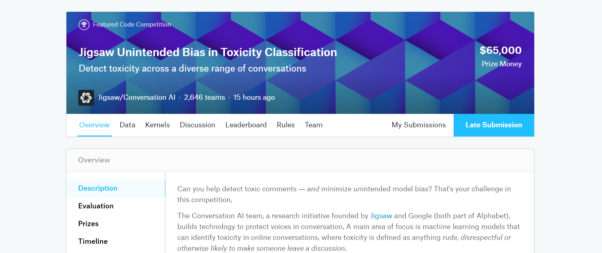

# Jigsaw Unintended Bias in Toxicity Classification

### Description

Can you help detect toxic comments ― and minimize unintended model bias? That's your challenge in this competition.

The Conversation AI team, a research initiative founded by Jigsaw and Google (both part of Alphabet), builds technology to protect voices in conversation. A main area of focus is machine learning models that can identify toxicity in online conversations, where toxicity is defined as anything rude, disrespectful or otherwise likely to make someone leave a discussion.

Last year, in the Toxic Comment Classification Challenge, you built multi-headed models to recognize toxicity and several subtypes of toxicity. This year's competition is a related challenge: building toxicity models that operate fairly across a diverse range of conversations.

Here’s the background: When the Conversation AI team first built toxicity models, they found that the models incorrectly learned to associate the names of frequently attacked identities with toxicity. Models predicted a high likelihood of toxicity for comments containing those identities (e.g. "gay"), even when those comments were not actually toxic (such as "I am a gay woman"). This happens because training data was pulled from available sources where unfortunately, certain identities are overwhelmingly referred to in offensive ways. Training a model from data with these imbalances risks simply mirroring those biases back to users.

In this competition, you're challenged to build a model that recognizes toxicity and minimizes this type of unintended bias with respect to mentions of identities. You'll be using a dataset labeled for identity mentions and optimizing a metric designed to measure unintended bias. Develop strategies to reduce unintended bias in machine learning models, and you'll help the Conversation AI team, and the entire industry, build models that work well for a wide range of conversations.

### Final Result: **Bronze medal** | Top 10% - 293/3165

- [Data](https://www.kaggle.com/c/jigsaw-unintended-bias-in-toxicity-classification/data)

- Code:
  - [Keras RNN Training](script/keras-rnn-training.html)
  - [BERT Training](script/bert-training.html)
  - [Inference - BERT & LSTM rank blender](script/bert-lstm-rank-blender.html)

---

[HomePage](../README.md)
