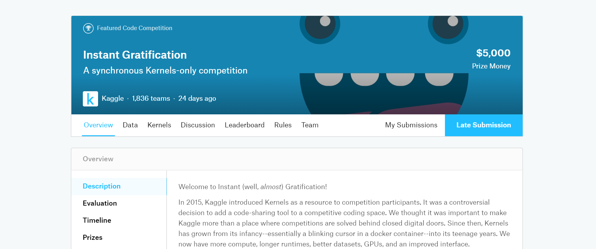

# [Instant Gratification Competition](https://www.kaggle.com/c/instant-gratification/overview)




### _Description_

We're now pleased to announce general support for a synchronous Kernels-only format. When you submit from a Kernel, Kaggle will run the code against both the public test set and private test set in real time. This small-but-substantial tweak improves the experience for participants, the host, and Kaggle:

With a truly withheld test set, we are practicing proper, rigorous machine learning.
We will be able to offer more varieties of competitions and intend to run many fewer confusing two-stage competitions.
You will be able to see if your code runs successfully on the withheld test set and have the leeway to intervene if it fails.
We will run all submissions against the private data, not just selected ones. Participants will get the complete and familiar public/private scores available in a traditional competition.
The final leaderboard can be released at the end of the competition, without the delay of rerunning Kernels.
This competition is a low-stakes, trial-run introduction to our new synchronous KO implementation. We want to test that the process goes smoothly and gather feedback on your experiences. While it may feel like a normal KO competition, there are complicated new mechanics in play, such as the selection logic of Kernels that are still running when the deadline passes.

Since the competition also presents an authentic machine learning problem, it will also award Kaggle medals and points. Have fun, good luck, and welcome to the world of synchronous Kernels competitions!

### Final Result: **Bronze medal** | Top 10% - 177/1839

---

- [Data](https://www.kaggle.com/c/instant-gratification/data)

This is an anonymized, binary classification dataset found on a USB stick that washed ashore in a bottle. There was no data dictionary with the dataset, but this poem was handwritten on an accompanying scrap of paper:

```
Silly column names abound, 
but the test set is a mystery. 
Careful how you pick and slice, 
or be left behind by history.
```

---

- Code: 
  - [Instant Gratification EDA](script/instant-gratification-eda-and-prediction.html)
  - [Instant Gratification Ensemble](script/instant-gratification-ensemble.html)

---

[HomePage](../README.md)
