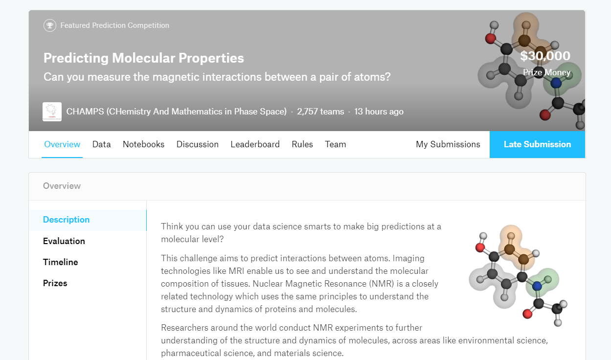

# [Predicting Molecular Properties](https://www.kaggle.com/c/champs-scalar-coupling/overview/description)

A special thanks goes to **[Laura](https://www.linkedin.com/in/laura-f-ab2010170/)**, my teammate, who really helped me in this project!

### _Description_

Think you can use your data science smarts to make big predictions at a molecular level?

This challenge aims to predict interactions between atoms. Imaging technologies like MRI enable us to see and understand the molecular composition of tissues. Nuclear Magnetic Resonance (NMR) is a closely related technology which uses the same principles to understand the structure and dynamics of proteins and molecules.

Researchers around the world conduct NMR experiments to further understanding of the structure and dynamics of molecules, across areas like environmental science, pharmaceutical science, and materials science.

This competition is hosted by members of the CHemistry and Mathematics in Phase Space (CHAMPS) at the University of Bristol, Cardiff University, Imperial College and the University of Leeds. Winning teams will have an opportunity to partner with this multi-university research program on an academic publication

Your Challenge

In this competition, you will develop an algorithm that can predict the magnetic interaction between two atoms in a molecule (i.e., the scalar coupling constant).

Once the competition finishes, CHAMPS would like to invite the top teams to present their work, discuss the details of their models, and work with them to write a joint research publication which discusses an open-source implementation of the solution.

About Scalar Coupling

Using NMR to gain insight into a molecule’s structure and dynamics depends on the ability to accurately predict so-called “scalar couplings”. These are effectively the magnetic interactions between a pair of atoms. The strength of this magnetic interaction depends on intervening electrons and chemical bonds that make up a molecule’s three-dimensional structure.

Using state-of-the-art methods from quantum mechanics, it is possible to accurately calculate scalar coupling constants given only a 3D molecular structure as input. However, these quantum mechanics calculations are extremely expensive (days or weeks per molecule), and therefore have limited applicability in day-to-day workflows.

A fast and reliable method to predict these interactions will allow medicinal chemists to gain structural insights faster and cheaper, enabling scientists to understand how the 3D chemical structure of a molecule affects its properties and behavior.

Ultimately, such tools will enable researchers to make progress in a range of important problems, like designing molecules to carry out specific cellular tasks, or designing better drug molecules to fight disease.

Join the CHAMPS Scalar Coupling challenge to apply predictive analytics to chemistry and chemical biology.

### _Final Result:_ Bronze medal | Top 9% - 248/2757

---

### _[Data](https://www.kaggle.com/c/champs-scalar-coupling/data)_

In this competition, you will be predicting the scalar_coupling_constant between atom pairs in molecules, given the two atom types (e.g., C and H), the coupling type (e.g., 2JHC), and any features you are able to create from the molecule structure (xyz) files.

For this competition, you will not be predicting all the atom pairs in each molecule rather, you will only need to predict the pairs that are explicitly listed in the train and test files. For example, some molecules contain Fluorine (F), but you will not be predicting the scalar coupling constant for any pair that includes F.

The training and test splits are by molecule, so that no molecule in the training data is found in the test data.

---

### _Code:_

  - [Final Solution - Blender](script/chemistry-of-best-models-upgrade-bronze.html) - PrivateLB: -1.91316, PublicLB: -1.91930
  - [Molecules EDA - by Laura](script/molecules-eda.html)
  - [SchNet - Upgrade](script/schnet-predicting-molecular-properties-upgrade.html)
  - [LGBM - Upgrade](script/lgbm-predicting-molecular-properties.html)

---

[HomePage](../README.md)
