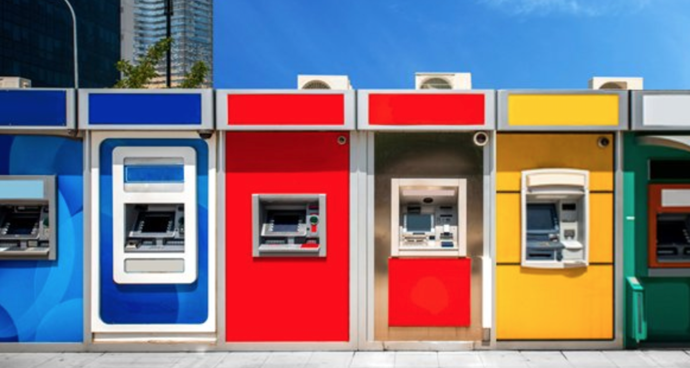

# Santander Customer Transaction Prediction

Here in this folder, I share the work I did for [Santander Customer Transaction Prediction Challenge](https://www.kaggle.com/c/santander-customer-transaction-prediction) Kaggle Competition

#### _Description_
At Santander our mission is to help people and businesses prosper. We are always looking for ways to help our customers understand their financial health and identify which products and services might help them achieve their monetary goals.

Our data science team is continually challenging our machine learning algorithms, working with the global data science community to make sure we can more accurately identify new ways to solve our most common challenge, binary classification problems such as: is a customer satisfied? Will a customer buy this product? Can a customer pay this loan?

In this challenge, we invite Kagglers to help us identify which customers will make a specific transaction in the future, irrespective of the amount of money transacted. The data provided for this competition has the same structure as the real data we have available to solve this problem.

#### _Data_

[Here](https://www.kaggle.com/c/santander-customer-transaction-prediction/data) you can find the training and testing datasets

## You can find two folders in this section:

### - [Exploratory Data Analysis](Exploratory_Data_Analysis)
### - [Predictive Analysis_& Model Tuning](PredictiveAnalysis_ModelTuning)

#### _Results_

_top 26%_

_Model: Light GBM -> CV: 0.901; PublicLB: 0.901; PrivateLB: 0.89981._

_Note_ : Inside PredictiveAnalysis_ModelTuning notebook you can also find different solution that achieved better scores.
Max: PublicLB: 0.92223; PrivateLB: 0.92057

---

[HomePage](../README.md)
